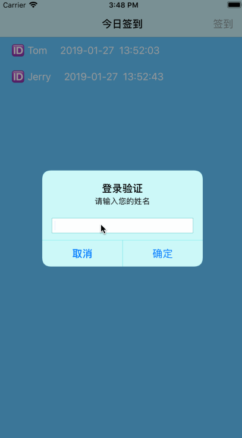

# 第13章  开发实践——上班签到App

## 13.1  功能简介  
- 此上班签到App具有以下功能：    
  1. 自动从本地数据库中读取并显示当天所有员工的已签到记录。  
  2. 员工可以通过右上角的“签到”按钮进行登录签到。签到后，员工名称和签到时间等信息会自动保存到本地数据库，并显示在当前签到列表中。  
  3. 按住某条签到记录，从右向左移动，会出现“删除”按钮，点击该按钮，可将该条记录从本地数据库和签到表中删除。  

- 运行效果：  
  

## 13.2  开发思路

- 具体开发思路如下：  
  1. 首先基于 Single View App 模板创建项目（创建时添加 Core Data 支持），然后将模板自带的视图控制器类（ViewController.swift）和故事模板文件中的视图控制器 ViewController 删除。  
  2. 往故事板文件中拖拽一个导航控制器（UINavigationController），它同时自带一个表视图控制器 Root View Controller。将导航控制器 Navigation Controller 设置为初始视图控制器，修改表视图控制器 Root View Controller 的导航栏标题（即“今日签到”），并在导航栏右端添加一个“签到”按钮，以构建应用界面。  
  3. 创建一个表视图控制器类（即 TableViewController.swift），将故事板中的表视图控制器与该表视图控制器类相关联，并为导航栏的“签到”按钮创建到该表视图控制器类的点击事件方法。  
  4. 打开数据库模型文件（.xdatamodeld），设计数据模型，并为创建的实体手动生成对应的类文件。  
  5. 在表视图控制器类（TableViewController.swift）中编写主要程序代码，实现“签到”按钮的点击功能、数据的本地持久化存储及表视图的初始化、数据加载和删除功能。  

## 13.3  实现过程

### 13.3.1  创建项目文件

### 13.3.2  设计用户界面

### 13.3.3  创建表视图控制器类

### 13.3.4  创建数据模型  

1. 步骤1：打开数据模型文件 Clockin.xdatamodeld，创建一个名称为 Person 的实体，它包含一个数据类型为 String 的 name 属性。  
2. 步骤2：选中实体 Person ，然后在其数据模型检查器中将 Codegen（代码生成方式）设置为 Manual/None（手动生成）。  
3. 步骤3：在项目导航面板中选中 Clockin.xdatamodeld 文件，然后选中 Editor → Create NSManagedObject Subclass 菜单命令。  
4. 此时弹出选择数据模型对话框，直接单击 Next 按钮。  
5. 此时弹出选择实体对话框，直接单击 Next 按钮。
6. 在弹出的保存对话框中保存默认的文件目录不变，单击 Create 按钮，此时可以看到在项目导航面板中已经生成了实体对应的两个类文件，将它们拖到数据模型文件下方即可。  

### 13.3.5  编写主要程序

- 代码清单：TableViewController.swift
```swift
//
//  TableViewController.swift
//  Clockin
//
//  Created by coderdream on 2018/12/16.
//  Copyright © 2018 coderdream. All rights reserved.
//

import UIKit
import CoreData

class TableViewController: UITableViewController {
    // 定义一个变量数组
    var staff = [NSManagedObject]()
    // 定义可重用单元格标识符
    let cellIdentifier = "reuseIndentifier"

    override func viewDidLoad() {
        super.viewDidLoad()
        
        //注册表视图单元格
        tableView.register(UITableViewCell.self, forCellReuseIdentifier: cellIdentifier)
        //设置表视图背景颜色
        tableView.backgroundColor = UIColor.init(red: 98/255, green: 198/255, blue: 255/255, alpha: 1)
        //不显示单元格分界线
        tableView.separatorStyle = .none
    }
    
    override func viewDidAppear(_ animated: Bool) {
        super.viewDidAppear(animated)
        //获取代理和托管对象
        let appDelegate = UIApplication.shared.delegate as! AppDelegate
        let managedObectContext = appDelegate.persistentContainer.viewContext
        //建立请求
        let fetchRequest = NSFetchRequest<NSFetchRequestResult>(entityName: "Person")
        //执行请求
        do {
            let fetchedResults = try managedObectContext.fetch(fetchRequest) as? [NSManagedObject]
            if let results = fetchedResults {
                staff = results
                
                tableView.reloadData()
            }
        } catch  {
            fatalError("获取失败")
        }
    }
    
    @IBAction func addName(_ sender: Any) {
        //创建一个对话框（即可输入文本的警告框）
        let alert = UIAlertController(title: "登录验证", message: "请输入您的姓名", preferredStyle: .alert)
        alert.addTextField { (textField: UITextField) in
        }
        
        //如果点击对话框的“确定”按钮
        let saveAction = UIAlertAction(title: "确定", style: .default) { (action: UIAlertAction!) in
            let textField = alert.textFields![0] as UITextField
            //获取当前时间
            let now = Date()
            //创建一个日期格式器
            let dformatter = DateFormatter()
            //dformatter.dateFormat = "yyyy年MM月dd日 HH:mm:ss"
            dformatter.dateFormat = "yyyy-MM-dd  HH:mm:ss"
            //将名字和当前日期进行拼接，并保存数据
            let newname = String(format: "🆔 %@     %@", textField.text!, dformatter.string(from: now))
            self.saveName(text: newname)
            //表视图显示新添加的数据
            let indexPath = IndexPath(row: self.staff.count - 1, section: 0)
            self.tableView.insertRows(at: [indexPath], with: .automatic)
        }
        
        //如果点击对话框的“取消”按钮
        let cancelAction = UIAlertAction(title: "取消", style: .cancel) { (action: UIAlertAction) in
            //不执行任何操作
        }
        
        alert.addAction(saveAction)
        alert.addAction(cancelAction)
        
        //弹出警告框
        present(alert, animated: true, completion: nil)

    }
    // MARK: - Table view data source

    override func numberOfSections(in tableView: UITableView) -> Int {
        // #warning Incomplete implementation, return the number of sections
        return 1
    }

    override func tableView(_ tableView: UITableView, numberOfRowsInSection section: Int) -> Int {
        // #warning Incomplete implementation, return the number of rows
        return staff.count
    }
    
    //为单元格提供数据
    override func tableView(_ tableView: UITableView, cellForRowAt indexPath: IndexPath) -> UITableViewCell {
        //通过可重用标识符获得可重用单元格对象
        let cell = tableView.dequeueReusableCell(withIdentifier: cellIdentifier, for: indexPath)
        //获取单元格内容
        let person = staff[indexPath.row]
        cell.textLabel?.text = person.value(forKey: "name") as? String
        //设置单元格的字体颜色和背景颜色
        cell.textLabel?.textColor = UIColor.white
        cell.backgroundColor = UIColor.init(red: 98/255, green: 198/255, blue: 255/255, alpha: 1)
        
        return cell
    }
    
    //保存数据
    private func saveName(text: String) {
        //获取代理和托管对象
        let appDelegate = UIApplication.shared.delegate as! AppDelegate
        let managedObectContext = appDelegate.persistentContainer.viewContext
        
        //建立一个实体entity
        let entity = NSEntityDescription.entity(forEntityName: "Person", in: managedObectContext)
        let person = NSManagedObject(entity: entity!, insertInto: managedObectContext)
        
        //保存文本框中的值到person数组
        person.setValue(text, forKey: "name")
        
        //保存entity到托管对象中。如果保存失败，进行处理
        do {
            try managedObectContext.save()
        } catch  {
            fatalError("无法保存")
        }
        //保存到数组中，更新UI
        staff.append(person)
    }
    
    // 设置删除按钮的标题
    override func tableView(_ tableView: UITableView, titleForDeleteConfirmationButtonForRowAt indexPath: IndexPath) -> String? {
        return "删除"
    }

    // 删除数据
    // Override to support editing the table view.
    override func tableView(_ tableView: UITableView, commit editingStyle: UITableViewCell.EditingStyle, forRowAt indexPath: IndexPath) {
        if editingStyle == .delete {
            //获取代理和托管对象
            let app = UIApplication.shared.delegate as! AppDelegate
            let contexts = app.persistentContainer.viewContext
            let entityName = "Person"
            //建立请求
            let fetchRequest:NSFetchRequest<NSFetchRequestResult> = NSFetchRequest()
            fetchRequest.fetchLimit = 10
            fetchRequest.fetchOffset = 0
            let entity = NSEntityDescription.entity(forEntityName: entityName, in: contexts)
            fetchRequest.entity = entity
            //设置查询条件
            let person = staff[indexPath.row]
            let del = person.value(forKey: "name") as? String
            let predicate = NSPredicate.init(format: "name = %@", del!)
            fetchRequest.predicate = predicate
            //查询并删除数据
            do {
                let fetchedObjects = try contexts.fetch(fetchRequest) as! [Person]
                for one: Person in fetchedObjects {
                    contexts.delete(one)
                    app.saveContext()
                }
            } catch {
                let nserror = error as NSError
                fatalError("查询错误： \(nserror), \(nserror.userInfo)")
            }
            //刷新表视图，更新UI
            let appDelegate = UIApplication.shared.delegate as! AppDelegate
            let managedObectContext = appDelegate.persistentContainer.viewContext
            let fetchRequest1 = NSFetchRequest<NSFetchRequestResult>(entityName: "Person")
            do {
                let fetchedResults = try managedObectContext.fetch(fetchRequest1) as? [NSManagedObject]
                if let results = fetchedResults {
                    staff = results
                    tableView.reloadData()
                }
            } catch {
                fatalError("获取失败")
            }
        }
    }
}
```

## 13.4  收尾工作  
1. 设置部署信息  
		Deployment Target: 11.0  
		Devices: iPhone  
		Device Orientation: Protrait（竖屏）   		
2. 设置图标  
      选择 Assets.xcassets → AppIcon，然后将图标拖拽到 AppIcon 界面对应的方框中。  
3. 设置启动画面  
   - 步骤1：选择打开 Assets.xcassets ，单击底部的“+”按钮，从弹出的快捷菜单中选择 App Icon & Launch Images → New iOS Launch Image 命令。  
   - 步骤2：此时会生成一个 LaunchImage 界面，将要使用的图片拖拽到 LaunchImage 界面的对应方框中。
   - 步骤3：选择 TARGETS → Clockin → General → App Icons and launch Images，单击 Launch Images Source 右侧的 Use Asset Catalog 按钮。
   - 步骤4：在弹出的提示框中单击 Migrate 按钮。此时会自动添加一个 LaunchImage-2，直接将其从 Assets.xcassets 中删除即可（因为已经提前创建好了 LaunchImage）。  
   - 步骤5：重新返回设置界面，从 Launch Images Source 下拉列表框中选择刚才添加的 LaunchImage，并将 Launch Screen File 中的内容删除。这样，启动画面就设置好了。
   